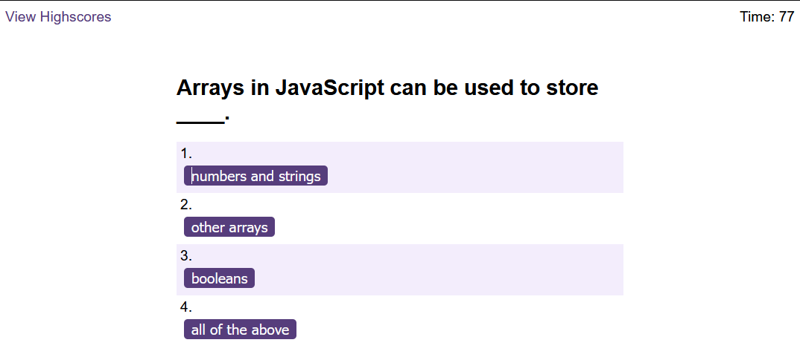

# Challenge 6 - Web APIs: Code Quiz

## Description
This is the 6th weekly challenge for UOB's Front End Developer and UX Bootcamp.

As a web developer, it is likely that I will be asked to complete various coding assessments, perhaps as part of an interview process.
So, to become familiar with this type of tests and to apply the skills learnt this week, the challenge is about building a timed coding quiz with multiple-choice questions. The app runs in the browser and the HTML is updated dynamically using JavaScript. The user interface is clean and responsive. 

The challenge follows agile project management conventions where it provides a user story, acceptance criteria, a mock-up demonstrating the application's functionality, and review guidelines.

## Table of Contents 

[Installation](#installation)
[Usage](#usage)
[Credits](#credits)
[License](#license)

### Installation

The steps required to complete the project are as goes: 

* When the start button is clicked, a timer starts and the first question appears.
* The questions contain 4 buttons, one of which has the correct answer and the rest have wrong answers.
* When an answer is clicked, right or wrong, the next question appears.
  * If the answer clicked was **Correct**, a "Correct" sound plays.
  * If the answer clicked was **Wrong**, a "Wrong" sound plays and 15 seconds are subtracted from the timer.
* The quiz ends when all questions are answered.
* When the game has ended, it displays the user's score and gives them the ability to save their initials and score.

### Usage

The Code Quiz page is used as a "mock test" of coding assessments. 

Screenshots from the page for reference:

Start Screen

Question 1

Question 2

Question 3

Question 4

Question 5

End Screen

High Scores Screen (TBC)

